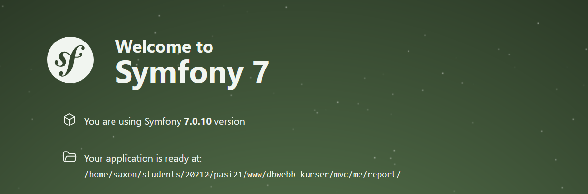

# Object-Oriented Web Technologies – MVC Project
[](https://scrutinizer-ci.com/g/SilvaCastillo/mvc/?branch=main)
[](https://scrutinizer-ci.com/g/SilvaCastillo/mvc/?branch=main)
[](https://scrutinizer-ci.com/g/SilvaCastillo/mvc/build-status/main)


Welcome to my project for the course MVC.
This application is built using **PHP** and the **Symfony** framework, following object-oriented principles, routing, and templating with Twig. The frontend is styled using **Tailwind CSS**  for a modern and responsive design.

## What's Included

- A **report site** with reflections, course work documenting and code analysis
- A **card game system** featuring Game 21 (simplified blackjack without betting) and deck management
- A **library management system** with full CRUD for books 
- A **JSON API** providing access to game and library data
- A **project site** (`/proj`) implementing a BlackJack game with its own distinct styling and nav


## Built With
- PHP 8.3.19
- Symfony 7.0.10
- Doctrine ORM 8.3.19
- Twig 3.20.0
- Tailwind CSS 3.4.1
- Composer 2.8.6
- NPM 10.8.2

## Code Quality & Testing
This application uses serval tools to maintain code quality:
- **PHPUnit** - Unit testing
- **PHPMetrics** - Code metrics and analysis
- **Scrutinizer** - Automated code analysis
- **PHPStan** - Static analysis
- **PHPMD** - Mess detector
- **PHP-CS-Fixer** - Code style fixer
- **PHPDocumentor** - Documentation generator

All tools are installed with `composer install`

## Getting Started

### Clone the repository

```
git clone git@github.com:SilvaCastillo/mvc.git
```

### Install dependencies

```bash
composer install
npm install
```

### Build frontend assets (Tailwind CSS)

```bash
npm run dev
```

#### For production:

```bash
npm run build
```

### Start the development server

Use PHP's built-in server:

```bash
php -S localhost:8000 -t public
```

### Run test

```bash
composer phpunit
```

### Run static analysis

```bash
composer lint
```

### Check code style

```bash
composer csfix:dry
```

### Fix code style issues

```bash
composer csfix
```

### Generate metrics report

```bash
composer phpmetrics
```

### Generate documentation

```bash
composer phpdoc
```
